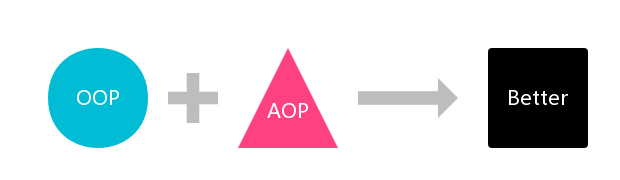

# 初探AOP

> 半亩方塘一鉴开，天光云影共徘徊。问渠哪得清如许？为有源头活水来。
> 

——《<cite>观书有感二首</cite>》

## 引子

> OOP + AOP -> Better

## 简介

### 是什么

AOP(*Aspect-Oriented Programming*，面向切面编程) 是对 OOP(*Object-Oriented Programming*，面向对象编程) 的强大补充。

- 在 OOP 中，模块化的关键单元是 类（*class*）；
- 在 AOP 中，模块化的关键单元是 切面（*aspect*）。

OOP 在横向上区分出一个个的类来，而 AOP 则通过切面在纵向上向对象加入特定的功能。有了 AOP，OOP 变得立体了。

### 为什么

在软件开发中，散布于应用中多处的功能被称为 **横切关注点（cross-cutting concerns）**。通常来讲，这些横切关注点从概念上是与应用的业务逻辑相分离的（但是往往会直接嵌入到应用的业务逻辑之中）。把这些横切关注点与业务逻辑相分离正是 AOP 所要解决的问题。

DI（*Dependency Injection*，依赖注入） 有助于应用对象之间的解耦，而 AOP 可以实现横切关注点与它们所影响的对象之间的解耦。

一个被划分为模块的典型应用如下图，它直观地呈现了 横切关注点 的概念：

每个模块的核心功能都是为特定业务领域提供服务，但是这些模块都需要类似的辅助功能，例如安全和事务管理。

先停下来思考一下，当要重用通用功能时，最常见的面向对象技术是继承（*inheritance*）或委托（*delegation*）。但是，如果在整个应用中都使用相同的基类，继承往往会导致一个脆弱的对象体系；而使用委托可能需要对委托对象进行复杂的调用。

切面提供了取代继承和委托的另一种可选方案，而且在很多场景下更为清晰简洁。
在使用 AOP 时，我们仍然在一个地方定义通用功能，但是可以通过声明的方式定义这个功能要以何种方式在何处应用，而无需修改受影响的类。横切关注点可以被模块化为特殊的类，这些类被称为切面。这样做有两个好处：
1. 每个关注点都集中于一个地方，而不是分散到多处代码中；
2. 服务模块更简洁，因为它们只包含 核心关注点（业务逻辑） 的代码，而 横切关注点（与业务逻辑无关） 的代码被转移到切面中了。

### 应用场景

- 日志
- 声明式事务
- 安全
- 缓存
- 全局异常处理

## AOP术语

### 通知（Advice）

切面的工作被称为通知，通知定义了切面是 **什么** 以及 **何时** 使用。

Spring 切面可以应用5种类型的通知：
- 前置通知（*Before*）：在目标方法被调用之前调用通知；
- 后置通知（*After*）：在目标方法完成之后调用通知，此时不会关心方法的输出是什么；
- 返回通知（*After returning*）：在目标方法成功执行之后调用通知；
- 异常通知（*After throwing*）：在目标方法抛出异常后调用通知；
- 环绕通知（*Around*）：通知包裹了被通知的方法，在被通知的方法调用之前和调用之后执行自定义的行为。

### 连接点（Join Point）

我们的应用可能有数以千计的时机应用通知，这些时机被称为连接点。连接点是在应用执行过程中能够插入切面的一个点。这个点可以是调用方法时、抛出异常时、甚至修改一个字段时。切面代码可以利用这些点插入到应用的正常流程之中，并添加新的行为。

### 切点（Pointcut）

一个切面并不需要通知应用的所有连接点，切点用于缩小切面所通知的连接点的范围。

切点定义了在 **何处** 使用切面。切点的定义会匹配通知所要织入的一个或多个连接点。我们通常使用明确的类和方法名称，或是利用正则表达式定义所匹配的类和方法名称来指定这些切点。有些 AOP 框架允许我们创建动态的切点，可以根据运行时的决策（比如方法的参数值）来决定是否应用通知。

### 切面（Aspect）

> 切面 = 通知 + 切点

通知和切点共同定义了切面的全部内容——它是什么，在何时和何处完成其功能。

### 引入（Introduction）

引入允许我们向现有的类添加新方法或属性。

### 织入（Weaving）

织入是把切面应用到目标对象并创建新的代理对象的过程。切面在指定的连接点被织入到目标对象中。

在目标对象的生命周期里有多个点可以进行织入：
- 编译期：切面在目标类编译时被织入。这种方式需要特殊的编译器。AspectJ 的织入编译器就是以这种方式织入切面的。
- 类加载期：切面在目标类加载到 JVM 时被织入。这种方式需要特殊的类加载器（*ClassLoader*），它可以在目标类被引入应用之前增强该目标类的字节码。AspectJ 5 的加载时织入（[Load-Time Weaving](https://eclipse.org/aspectj/doc/released/devguide/ltw.html)，LTW）就支持以这种方式织入切面。
- 运行期：切面在应用运行的某个时刻被织入。一般情况下，在织入切面时，AOP 容器会为目标对象动态地创建一个代理对象。[Spring AOP](https://docs.spring.io/spring/docs/current/spring-framework-reference/html/aop.html#aop-introduction-proxies) 就是以这种方式织入切面的。

### 总结

通知 包含了需要用于多个应用对象的横切行为；
连接点 是程序执行过程中能够应用通知的所有点；
切点 定义了通知被应用的具体位置（在哪些连接点），即哪些连接点会得到通知。

（未完待续...）
